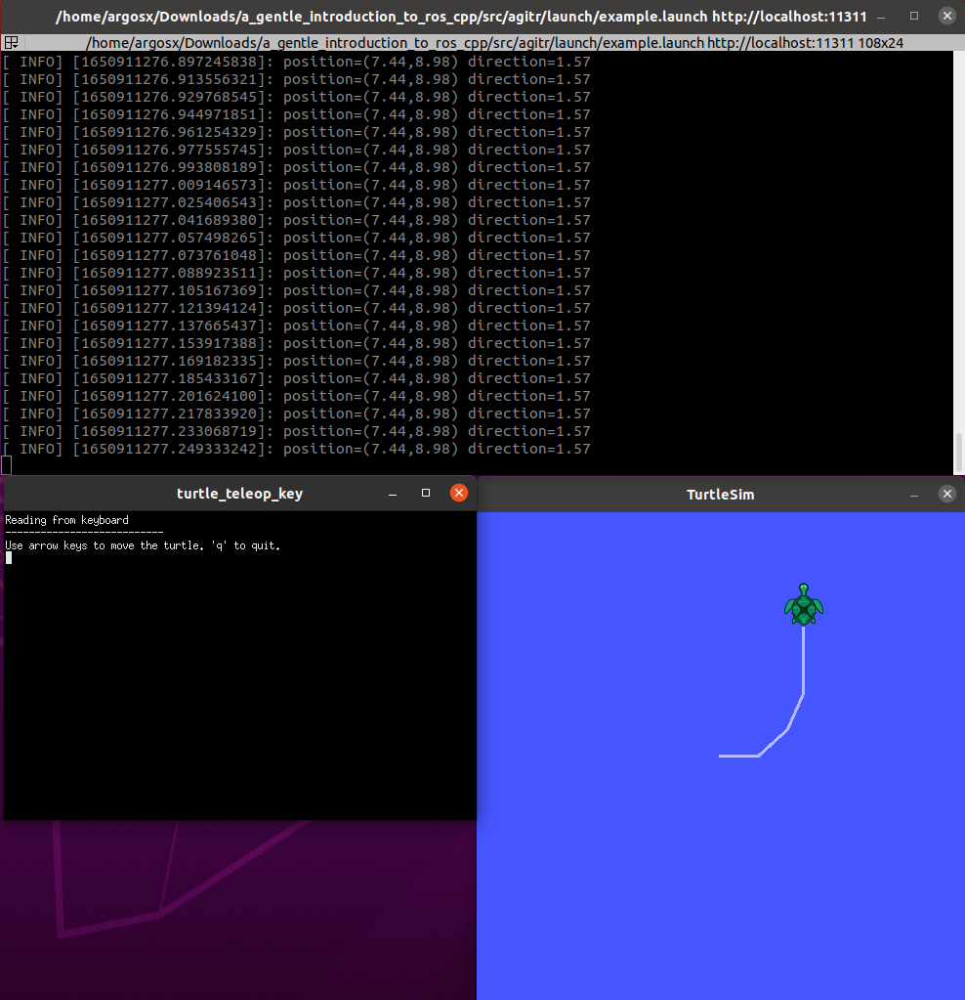

# A gentle introduction to ros (cpp)

This repository has code exercises from the book [A Gentle Introduction to ROS](https://www.cse.sc.edu/~jokane/agitr/) by Jason O'Kane. All codes are developed using C++.

## Dependencies
* [ROS noetic](http://wiki.ros.org/noetic)
* [gcc >= 9.4.0](https://gcc.gnu.org/)
* [cmake >= 3.16.3](https://cmake.org/)
* xterm

## Basic usage
1. Clone this repo.
2. In terminal, open the project folder: `cd /path_to_folder/a_gentle_introduction_to_ros_cpp`.
3. Inside the project folder, build the packages: `catkin_make`.
4. Source files: `source devel/setup.bash`.
5. Run an example: `roslaunch agitr example.launch`. 
